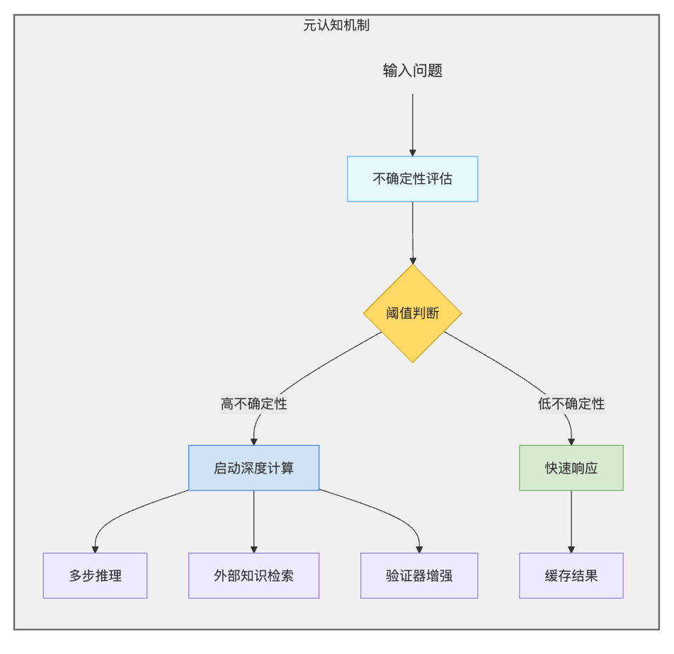

# AstroAlignment
This repository is dedicated to AstroAlignment. Our objective is to augment the capabilities of Large Language Models (LLMs) within astronomical scenarios.

### 可以考虑给我们的方法加入元认知机制（Meta-Cognition）
核心思想是让模型学会何时需要深入思考。元认知是指对认知的认知，即对自己的思考过程的思考。通过赋予模型元认知能力，可以使其能够判断自身是否能够解决当前的问题，并根据需要分配更多的计算资源。

